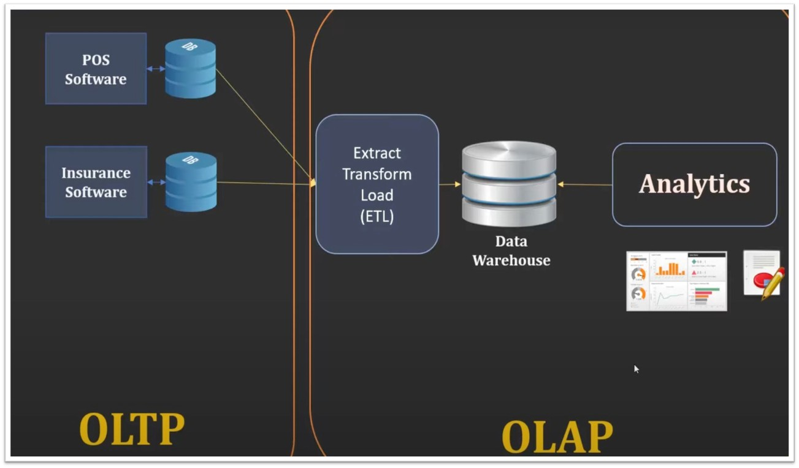

# 📊 **Customer Shopping Analysis**

---

## **Overview**
In today's rapidly evolving retail landscape, understanding customer behavior is crucial. **Customer Shopping Trends** is an analytics-driven application that provides businesses with valuable insights into sales, customer demographics, and product trends. This project is designed to facilitate **data-driven decision-making**, enhance **inventory management**, and optimize **customer engagement strategies**.

### **Key Features**
- 🔍 **Shopping Trend Analytics**: Track purchasing patterns over time.
- 🏪 **Operational Efficiency**: Streamlined billing and inventory management.
- 📈 **Revenue Dashboard**: Analyze total revenue by category, season, and region.
- 👥 **Customer Demographics**: Understand age, gender, and shopping preferences.
- 📊 **Product Sales Analysis**: Evaluate sales trends by year, month, and quarter.
- 🔒 **User Authentication**: Secure access for employees and administrators.

---

## **Tech Stack**
- **Frontend**: Tkinter (Python GUI)
- **Backend**: MySQL (Operational & Analytical Databases)
- **Data Processing**: Python (Pandas, NumPy, Matplotlib)
- **ETL Pipeline**: Python scripts for data extraction, transformation, and loading
- **Visualization**: Matplotlib, stored procedures, and SQL views for interactive dashboards

---

## **Dataset**
The application uses a dataset from Kaggle:

🔗 [Customer Shopping Trends Dataset](https://www.kaggle.com/datasets/iamsouravbanerjee/customer-shopping-trends-dataset)

This dataset contains:
- Customer demographics (age, gender, purchase frequency)
- Purchase history and payment methods
- Seasonal trends and region-based insights




---

## **Installation & Setup**
To run the application, follow these steps:

1. **Clone the repository**:
   ```bash
   git clone https://github.com/your-username/customer-shopping-trends.git
   cd customer-shopping-trends
   ```

2. **Install dependencies**:
   ```bash
   pip install -r requirements.txt
   ```

3. **Set up the MySQL Database**:
   - Import the provided SQL schema into MySQL.
   - Update `config.py` with your database credentials.

4. **Run the application**:
   ```bash
   python main_final.py
   ```
---

## **Application Modules**
### 🔹 **Operational Use**
- **Store Employee Portal**:  
  - Generate invoices for purchased products.
  - Secure login with username & password.
  - Real-time inventory tracking.

- **Store Admin Portal**:  
  - Manage employees and invoices.
  - Access inventory & billing records.

### 🔹 **Analytical Use**
- **Revenue Dashboard**:  
  - Analyze sales by category, season, and region.
- **Customer Demographics Analysis**:  
  - Insights on customer shopping behavior.
- **Product Sales Analytics**:  
  - Drill-down analysis by month, quarter, and year.

---

## **Database Design**
The project follows a **structured database design**, incorporating:
- **Operational Database (OLTP)**
  - Tables: `Customers`, `Items`, `Purchases`, `Payments`, `Location`
  - Secure **user authentication** for admins and employees
- **Analytical Database (OLAP)**
  - **Star Schema Design** for advanced reporting
  - Dimensions: `Customer_dim`, `Item_dim`, `Location_dim`, `Calendar_dim`
  - Fact Table: `Sales_Fact`

🔹 **Stored Procedures & Views**:
- **GetMonthlyRevenue()** – Analyze revenue trends
- **GetCustomerCountByYear()** – Track customer growth
- **TopSellingItemsView** – Identify top-selling products

---

## **ETL Pipeline**
🚀 The project includes an **ETL (Extract, Transform, Load) pipeline** that:
1. Extracts transactional data from source files.
2. Cleans and standardizes the data.
3. Loads processed data into both **Operational** and **Analytical** databases.

---


## **License**
📜 This project is licensed under the **MIT License** – see the [LICENSE](LICENSE) file for details.
